# Trouble Brewing Highlighter

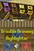

Follow the brewing routes, see which supplies your team needs, and keep your Pieces of Eight progress in view.

[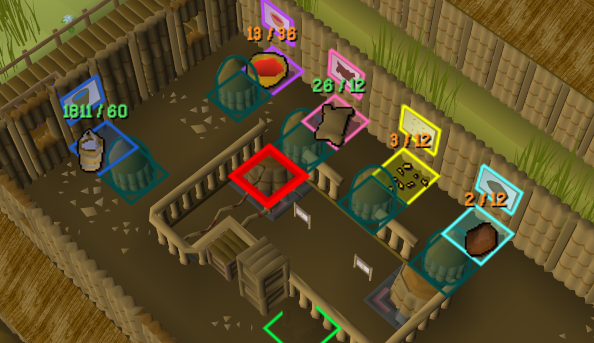](docs/images/station-amounts.png)

## Follow each resource route

Matching colours connect world objects, inventory supplies and the tool selector. Water, flowers, coloured water, bark, sweetgrubs, bitternuts and finished rum each have their own route.

- **Resources:** toggle individual routes, boiler fuel, team hoppers and damage/repair highlights independently.
- **Colours:** customise each route to make the supplies you use easiest to spot.
- **Display:** choose convex hulls, tiles, outline width and fill opacity.
- **Flashing:** choose which categories draw extra attention. Fires and active conveyors flash by default; other categories start steady.

<table>
  <tr>
    <td><strong>Island resource highlights</strong></td>
    <td><strong>Processing-route highlights</strong></td>
  </tr>
  <tr>
    <td><a href="docs/images/route-example-island.png">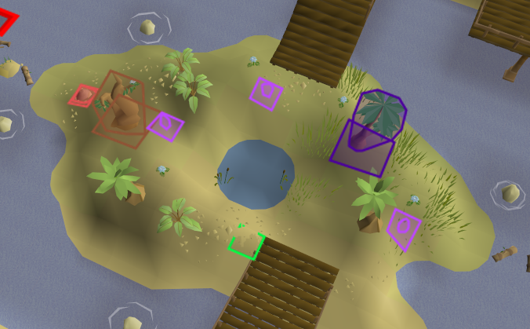</a></td>
    <td><a href="docs/images/route-example-stations.png">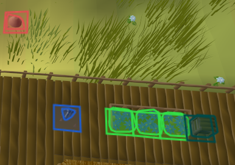</a></td>
  </tr>
</table>

Highlights carry through to supplied tools and the inventory, where current/target badges show how much the team has collected.

<table>
  <tr>
    <td><strong>Tool selector</strong></td>
    <td><strong>Inventory supply targets</strong></td>
  </tr>
  <tr>
    <td><a href="docs/images/tool-selector.png">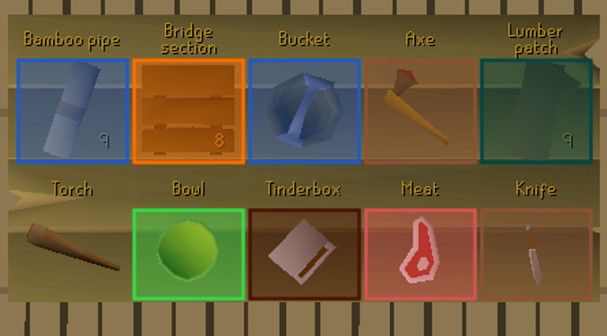</a></td>
    <td><a href="docs/images/inventory-targets.png">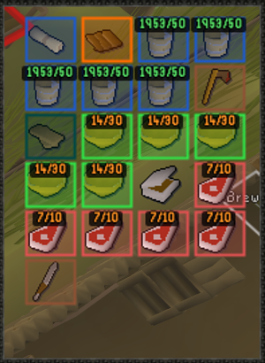</a></td>
  </tr>
</table>

## Configure the highlights

The options are split into display and resources, flashing and helpers, and a matching colour palette. Click any settings image to view it at full size.

<table>
  <tr>
    <td><strong>Display &amp; resources</strong></td>
    <td><strong>Flashing &amp; helpers</strong></td>
    <td><strong>Colours</strong></td>
  </tr>
  <tr>
    <td><a href="docs/images/settings-display-resources.png">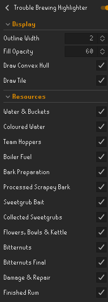</a></td>
    <td><a href="docs/images/settings-flashing-helpers.png">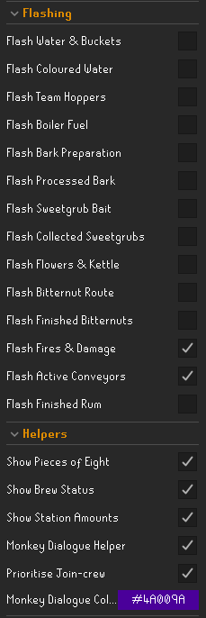</a></td>
    <td><a href="docs/images/settings-colours.png">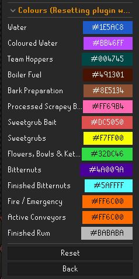</a></td>
  </tr>
</table>

## Know what to gather next

- **Show Brew Status** displays a movable panel with the next action, ingredient targets, boiler fuel, rum state and time remaining.
- Targets adjust to the rum that can still finish before the match ends. Red means empty, orange means more is needed, and green means enough for the remaining run.
- **Show Station Amounts** adds supply totals to upstairs stations and current/target inventory badges. Keep these visible even with the Brew Status panel hidden.
- Boilers distinguish empty, loaded-but-unlit and active states, highlighting logs or a tinderbox when useful.

<table>
  <tr>
    <td><strong>Brew Status</strong></td>
    <td><strong>Boiler guidance</strong></td>
  </tr>
  <tr>
    <td><a href="docs/images/brew-status.png">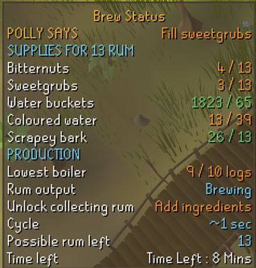</a></td>
    <td><a href="docs/images/boiler-guidance.png">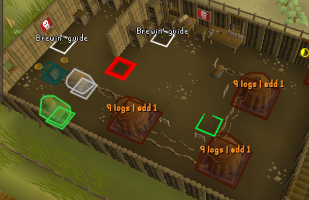</a></td>
  </tr>
</table>

## Handle repairs and monkey runs

- **Damage & Repair** shows fires, the appropriate repair materials and remaining parts. Your team's emergencies trigger flashing; opposing-team damage stays steady.
- **Monkey Dialogue Helper** highlights Careful for the first monkey and Angry for its paired follow-up.
- **Prioritise Join-crew** moves the existing Join-crew option up the menu on San Fan and Fancy Dan.

## Track Pieces of Eight

**Show Pieces of Eight** displays your cached total near the minigame. During a match it adds your personal contribution and the expected new total from contribution and rum already produced. Hold **Alt** and drag to reposition the panels.

These helpers display information and reorder the existing Join-crew option; you still perform every game interaction yourself. Cycle timing and remaining-run targets are estimates.

## Installation

Open RuneLite's **Configuration → Plugin Hub**, search for **Trouble Brewing Highlighter** and install it. Open the plugin's settings to customise the options above.

[View on the Plugin Hub](https://runelite.net/plugin-hub/show/trouble-brewing-highlighter).

## Development

See [development and implementation reference](DEVELOPMENT_REFERENCE.md) for the preserved setup instructions, technical details, testing notes and existing project documentation.

## Support

Enjoy the plugin? [Visit the GSVS UK ACM Patreon shop](https://www.patreon.com/cw/GSVS_UK_ACM/shop) to support the work.
